  

 

<table>
<tr>
<td align="center">🎓 <b>9.17</b> CGPA</td>
<td align="center">🏆 <b>Director's Award</b> Techno Wiz 2026</td>
<td align="center">🥇 <b>1st Place</b> IEEE WIE Hackathon</td>
<td align="center">💼 <b>EY GDS</b> Assoc. SWE · Sep 2026</td>
</tr>
</table>

---

### 📟 stack_confidence.log

 

<b>🏆 Achievements & Certifications</b>

 

| Recognition | Detail |
|---|---|
| 🏆 **Director's Award — Techno Wiz (2026)** | Recognised by the Institute Director as the highest-ranked technical project among final-year graduates |
| 🥇 **IEEE WIE Hackathon — 1st Place (Aug 2023)** | Placed first among 30+ competing teams; solution scored highest on accuracy, scalability & real-world impact |
| 🔬 **Junior Researcher, IEM IEDC (Feb 2023 – Mar 2024)** | Conducted applied AI/ML research; contributed to 2 internal reports on model performance optimisation |
| 🛡️ **Threat Prism Certification (Feb 2023)** | Cyber Security & Ethical Hacking |

<b>💼 Experience</b>

 

**Software Development Intern** · Catchaxe (Remote) · May 2025 – Jan 2026
- Engineered Python + FastAPI pipelines processing 100k+ ad campaign records, cutting reporting time by 50%
- Deployed 10+ production REST APIs on GCP Cloud SQL, boosting scalability by 40% under live traffic
- Architected a multi-agent RAG chatbot (LangChain + LLMs), raising prediction accuracy by 25%

**Web Dev Core Member** · Google Developer Student Clubs, IEM · Aug 2023 – Jul 2024
- Organised 5 technical workshops engaging 100+ students; mentored 3 junior members

**Web Development Intern** · Bambhari, Bengaluru · Jun 2023 – Aug 2023
- Delivered 4 responsive web features, accelerating page load time by 20%

---

### 📌 Featured Projects

| Project | Description | Stack |
|---|---|---|
| **[DocAnalyser](https://github.com/Sayancode2026/DocAI)** | RAG-based document intelligence platform for PDF Q&A & summarisation — 90%+ response relevance across 500+ queries | Python, FastAPI, LangChain, Gemini API, ChromaDB |
| **[TrueState Sales System](https://github.com/Sayancode2026/truestate-sales-system_sayan)** | Full-stack retail sales management app with search, multi-filter, sorting & pagination for large-scale transactional data — Redis-cached filters, CSV export | React, Node.js, Express.js, PostgreSQL, Redis |
| **[SafePath AI](https://github.com/Sayancode2026/SafePath-AI-Smart-detection-for-safer-roads)** | Road damage detection on 9,000+ images — 88% mAP, live Streamlit dashboard | YOLOv8, OpenCV, Streamlit, Pandas |

---

### 📊 Real-Time GitHub Analytics

  
  

  

  

### 🐍 Contribution Snake

  

---

⭐ If any of this was useful to you, a star on a repo goes a long way. 
Thanks for stopping by — always building something new.

